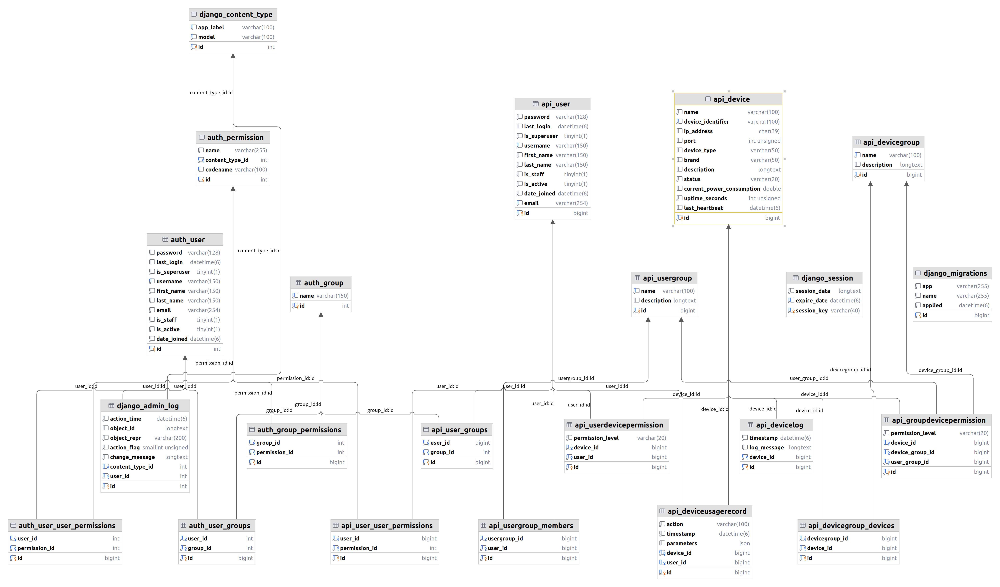

# backend
用于存放后端代码

## 数据库
创建：
```shell
python manage.py makemigrations api
python manage.py migrate
```
运行：
```shell
python manage.py createsuperuser # 先创建管理员
python manage.py runserver
```
管理员页面：
`http://127.0.0.1:8000/admin/`

单元测试：
```shell
python manage.py test api  # 只运行 api 应用的测试
python manage.py test api.tests.test_auth_views # 运行特定文件的测试
python manage.py test api.tests.test_auth_views.AuthTests.test_login_success # 运行特定测试用例的特定方法
python manage.py test # 运行项目中所有应用的测试
```
ER图：